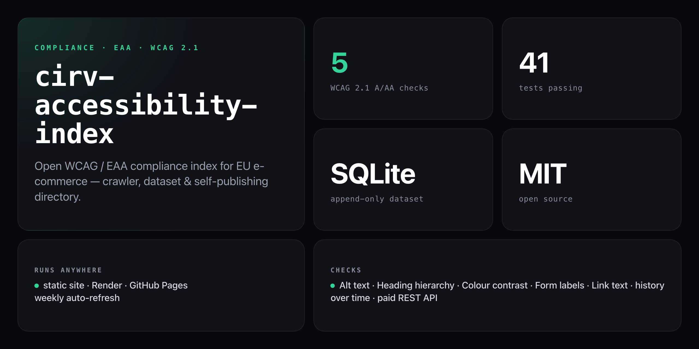

<div align="center">

**The open compliance index for EU e-commerce — crawler, dataset & self-publishing directory, no ads, no babysitting.**


</div>

---

The EU's **European Accessibility Act** is enforceable as of 2025 — online stores selling into the EU must meet WCAG 2.1 AA or face penalties. Yet no one publishes an open, queryable compliance index. This fills that gap.

The **Cirv Accessibility Index** crawls EU e-commerce store homepages, scores them against five WCAG 2.1 A/AA rules, and publishes the results as a ranked leaderboard with a shareable report page per store — engineered to rank in search and get cited by AI assistants.

```
$ npm run report

dataset: 38 domains  ·  38 latest scores

=== leaderboard (best first) ===
 80  example.eu           0 fails
 72  shop.demo.nl         1 fails
 60  store.sample.de      3 fails
 --  blocked.example.fr   error: blocked_403

ok 35 · skipped 0 · error 3
```

## Install

```bash
git clone https://github.com/NickCirv/cirv-accessibility-index.git
cd cirv-accessibility-index
npm install
```

## Quick start

```bash
# crawl the default seed list into data/index.db
npm run crawl seeds/eaa-ecommerce.json

# generate the static directory into ./public
npm run build

# or do both in one step
npm run refresh

# open the result
open public/index.html
```

## Commands

| Command | What it does |
|---------|--------------|
| `npm run crawl <seeds.json>` | Crawl a seed list into `data/index.db` |
| `npm run build` | Generate `./public` from the dataset |
| `npm run refresh` | Crawl default seeds, then build |
| `npm run report` | Print leaderboard + error breakdown to stdout |
| `npm run api` | Start the paid REST API server |
| `npm test` | Run crawler + API test suites |

### Crawler flags

```bash
node bin/crawl.js seeds/eaa-ecommerce.json [--db path] [--concurrency N] [--no-robots]
```

| Flag | Default | Description |
|------|---------|-------------|
| `--db <path>` | `data/index.db` | SQLite database path |
| `--concurrency <N>` | `4` | Parallel requests |
| `--no-robots` | off | Skip `robots.txt` checks |

### Build-site flags

```bash
node bin/build-site.js [--db path] [--out dir] [--base url] [--mode soft|named]
```

| Flag | Description |
|------|-------------|
| `--mode named` | Show all store names (default `soft` hides D/F grades behind a CTA) |
| `--base <url>` | Set canonical base URL for sitemap |
| `--out <dir>` | Output directory (default `./public`) |
| `--api-url <url>` | Wire the API CTA to a live endpoint |

## What it scans

Five WCAG 2.1 Level A/AA checks on each store's homepage:

| Check | WCAG | What it catches |
|-------|------|-----------------|
| Alt text | 1.1.1 (A) | Images missing text alternatives |
| Heading hierarchy | 1.3.1 (A) | Missing/duplicate H1, skipped levels |
| Colour contrast | 1.4.3 (AA) | Inline text/background below 4.5:1 ratio |
| Form labels | 1.3.1 (A) | Inputs with no programmatic label |
| Link text | 2.4.4 (A) | Empty or generic ("click here") links |

## Data schema

All scans land in a single SQLite table (`data/index.db`) — append-only, so you get the latest score **and** full history from one place.

| Column | Type | Notes |
|--------|------|-------|
| `domain` | TEXT | Normalised (no scheme/`www`) |
| `status` | TEXT | `ok` · `error` · `skipped` |
| `score` | INTEGER | 0–100 (null if not `ok`) |
| `passes` / `fails` / `total` | INTEGER | Check counts |
| `results_json` | TEXT | Full per-check findings |
| `error_code` | TEXT | `blocked_403` · `timeout` · `dns` … |
| `scanned_at` | INTEGER | Epoch ms |

The build step also emits **`public/data.json`** — a machine-readable snapshot suitable for API consumption or AI training.

## REST API

A paid REST API (`api/`) serves the full named dataset. Auth by API key; tiers billed via Stripe.

| Tier | Price | Rate limit |
|------|-------|-----------|
| Free | — | 100 req/day |
| Starter | $29/mo | 5,000/day |
| Pro | $99/mo | 50,000/day |
| Bulk | $299/mo | 500,000/day |

Run locally with `npm run api`. Configure via `api/.env.example`. API keys are stored hashed; Stripe secrets are env-only.

Live: [directory](https://cirv-accessibility-index.onrender.com) · [API status](https://cirv-index-api.onrender.com/healthz)

## Deploy

The `public/` directory is prebuilt — no compile step at deploy.

- **Static (any host):** publish `public/` to Netlify, Cloudflare Pages, GitHub Pages, or S3.
- **Render blueprint:** `render.yaml` is included — New → Blueprint → Apply.
- **Auto-refresh:** a GitHub Actions workflow (`.github/workflows/refresh.yml`) runs `npm run refresh` on a schedule and commits the updated `public/`.

## What it is NOT

- **Not a full WCAG audit.** Automated tools catch roughly 30–40% of WCAG issues. A score of 100 means no automated failures on the homepage — not guaranteed legal conformance.
- **Not a bot-protection bypass.** Sites behind Cloudflare/Akamai that block scanners are listed as `error: blocked_403`, never worked around.
- **Not legal advice.** This is an informational index. Confirm compliance with a qualified accessibility audit.

## Part of the Cirv suite

- **[Cirv Guard](https://wordpress.org/plugins/cirv-guard/)** — the WordPress accessibility plugin that fixes the issues this index surfaces. The WCAG engine in `engine/` is vendored from Cirv Guard's canonical rules (see [`docs/adr/0001`](./docs/adr/0001-vendored-engine.md)).
- The index is the top of the funnel: awareness → report → scanner → plugin.

## Contributing

PRs welcome — see [CONTRIBUTING.md](./CONTRIBUTING.md). Tests-first, escape untrusted data, stay a polite crawler.

---

<div align="center">
<sub>Node 22 · SQLite · MIT · by <a href="https://cirvgreen.com">Cirvgreen</a> / <a href="https://github.com/NickCirv">NickCirv</a></sub>
</div>
