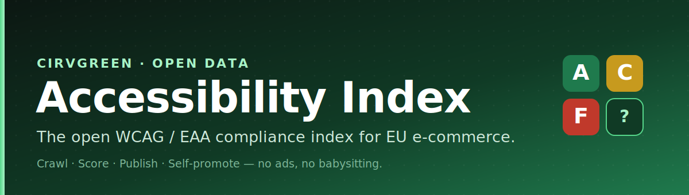
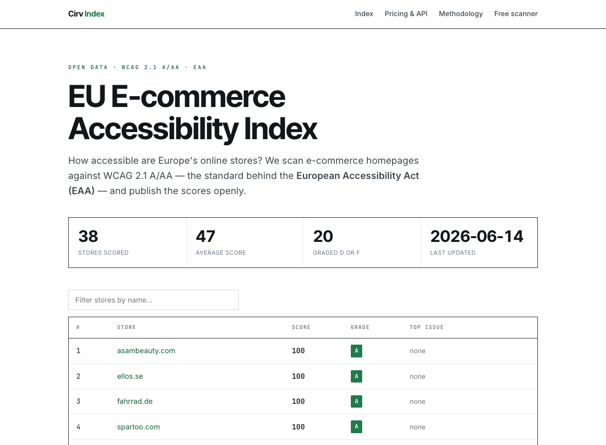
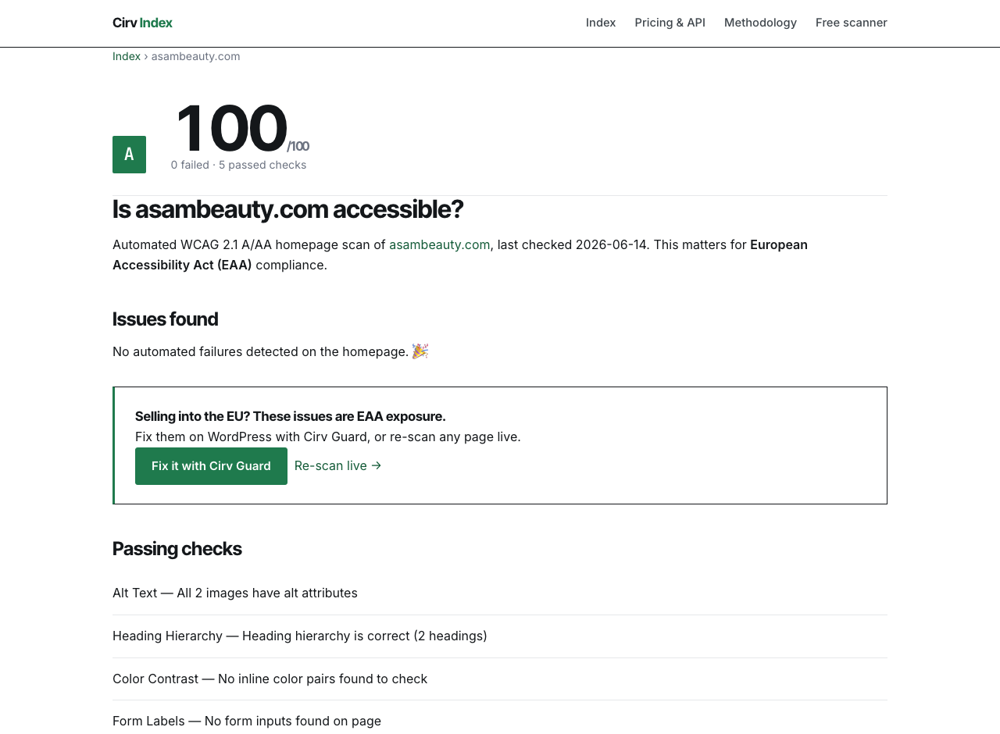

<p align="center">
  
</p>

<p align="center">
  <a href="./LICENSE"></a>
  <a href="https://github.com/NickCirv/cirv-accessibility-index/actions/workflows/ci.yml"></a>
  
  
  
  
  <a href="./CONTRIBUTING.md"></a>
</p>

<p align="center">
  <b>An open index of how accessible EU e-commerce stores are.</b><br>
  It crawls store homepages, scores them against WCAG 2.1 A/AA — the standard behind the <b>European Accessibility Act</b> — and publishes the results as a directory that ranks itself in search and gets cited by AI. No ads. No babysitting.
</p>

<p align="center">
  <a href="#-quick-start">Quick start</a> ·
  <a href="#-how-it-works">How it works</a> ·
  <a href="#%EF%B8%8F-what-to-look-out-for">Caveats</a> ·
  <a href="#-what-it-stores">Data</a> ·
  <a href="#-deploy">Deploy</a> ·
  <a href="#-roadmap">Roadmap</a>
</p>

<p align="center">
  <b>Live:</b> <a href="https://cirv-accessibility-index.onrender.com">directory</a> ·
  <a href="https://cirv-accessibility-index.onrender.com/pricing.html">pricing &amp; API</a> ·
  <a href="https://cirv-index-api.onrender.com/healthz">API status</a>
</p>

---

<p align="center">
  
  <br><em>The leaderboard — every EU store, ranked by accessibility, updated automatically.</em>
</p>

## What is this?

The **Cirv Accessibility Index** turns a one-off accessibility scanner into a **compounding data product**:

1. A **crawler** scans the homepages of EU e-commerce stores against WCAG 2.1 A/AA.
2. A **dataset** records each store's score, grade, and specific failures over time.
3. A **static directory** publishes it all — a ranked leaderboard plus a shareable report page per store — engineered to rank in Google and be cited by AI assistants.
4. Every page funnels readers to a free live scanner and to [**Cirv Guard**](#-part-of-the-cirv-suite), the WordPress plugin that fixes the issues.

It self-promotes (search + AI citation, no ads), refreshes on a schedule (no babysitting), and the data nobody else publishes openly is the moat.

> **Why now?** The EU's **European Accessibility Act** is enforceable as of 2025 — online stores selling into the EU must meet WCAG 2.1 AA or face penalties. Demand for "am I compliant?" is real and budget-backed, yet no one publishes an open, queryable compliance index. This fills that gap.

## ✨ Quick start

```bash
git clone https://github.com/NickCirv/cirv-accessibility-index.git
cd cirv-accessibility-index
npm install

# crawl the seed list into a local dataset (data/index.db)
npm run crawl seeds/eaa-ecommerce.json

# generate the static directory into ./public
npm run build

# open the result
open public/index.html      # macOS  (xdg-open on Linux, start on Windows)
```

Or do both in one step: `npm run refresh`. Run the tests with `npm test`.

## 🧭 How it works

```
            seeds/*.json  (EU e-commerce domains, EAA scope)
                  │
                  ▼
   ┌───────────────────────────────┐     respects robots.txt
   │  crawler  (src/crawl.js)       │     honest UA, retry+backoff
   │  ├─ engine/fetch.js  (SSRF-safe fetch)
   │  └─ engine/checks.js (WCAG 2.1 A/AA rules)
   └───────────────┬───────────────┘
                   ▼
        SQLite dataset (data/index.db)        ← append-only: latest score + history
                   │
                   ▼
   ┌───────────────────────────────┐
   │  generator (src/site.js)       │  →  public/
   │  ranked index · report pages   │      ├─ index.html        (leaderboard)
   │  methodology · data.json       │      ├─ sites/<domain>.html (per-store report)
   │  sitemap · robots              │      ├─ data.json          (machine-readable)
   └───────────────────────────────┘      └─ sitemap.xml, robots.txt
```

The WCAG engine in `engine/` is shared, deterministic, and dependency-light (`cheerio` for parsing). The crawler is polite by design (concurrency-limited, rate-delayed, `robots.txt`-aware). The output is **pure static HTML** — deploy it anywhere.

## 🔍 What it scans

Five WCAG 2.1 Level A/AA checks on each store's homepage:

| Check | WCAG | What it catches |
|-------|------|-----------------|
| Alt text | 1.1.1 (A) | Images missing text alternatives |
| Heading hierarchy | 1.3.1 (A) | Missing/duplicate H1, skipped levels |
| Colour contrast | 1.4.3 (AA) | Inline text/background below 4.5:1 |
| Form labels | 1.3.1 (A) | Inputs with no programmatic label |
| Link text | 2.4.4 (A) | Empty or generic ("click here") links |

Full detail: the generated **`/methodology.html`** page.

<p align="center">
  
  <br><em>Every store gets a shareable report page — score, issues, and a fix path.</em>
</p>

## ⚠️ What to look out for

Read this before you trust a score:

- **It's an automated signal, not an audit.** Automated tools catch roughly **30–40%** of WCAG issues. A 100 means *no automated failures on the homepage* — not guaranteed conformance. Manual testing is still required for real compliance.
- **Homepage only (for now).** One page per store. Deep pages (checkout, product) aren't scanned yet — and checkout is where EAA risk concentrates.
- **The score is a pass-ratio**, not severity-weighted. One critical failure and ten trivial passes can still score high. Treat grades as a triage signal.
- **Contrast is inline-only.** We read inline `style` colours; CSS-file and computed contrast aren't evaluated (no headless browser).
- **Bot-protected sites can't be scanned.** Many large retailers block automated access (Cloudflare/Akamai). We **do not bypass** bot protection — those are listed honestly as "couldn't scan", never worked around.
- **Not legal advice.** This is an informational index. Confirm compliance with a qualified audit.
- **Scores change.** Sites are re-scanned over time; a grade is a point-in-time reading (`scanned_at`).

## 💾 What it stores

Everything lands in a single SQLite table — **append-only**, so you get the latest score *and* full history from one place.

**`scans`**

| Column | Type | Notes |
|--------|------|-------|
| `id` | INTEGER PK | autoincrement |
| `domain` | TEXT | normalised (no scheme/`www`) |
| `final_url` | TEXT | after redirects |
| `status` | TEXT | `ok` · `error` · `skipped` |
| `score` | INTEGER | 0–100 (null if not `ok`) |
| `passes` / `fails` / `total` | INTEGER | check counts |
| `results_json` | TEXT | full per-check findings (JSON) |
| `error_code` | TEXT | `blocked_403` · `timeout` · `not_html` · `dns` … |
| `scanned_at` | INTEGER | epoch ms |

The generator also emits **`public/data.json`** — a clean, machine-readable snapshot (the precursor to the paid API):

```json
{
  "updated": "2026-06-15",
  "mode": "soft",
  "count": 38,
  "sites": [
    { "domain": "example.eu", "status": "ok", "score": 80, "grade": "B",
      "fails": 2, "passes": 8, "top_issue": "Alt Text", "scanned_at": 1750000000000 }
  ]
}
```

Nothing personal is ever stored — only public homepage markup is analysed.

## 🔌 API

A paid REST API (`api/`) serves the **full, named** dataset (the public site is soft — paying is how you see everything). Auth is by API key (stored hashed); tiers are billed via **Stripe**.

| Tier | Price | Rate limit |
|------|-------|-----------|
| Free | — | 100 req/day |
| Starter | $29/mo | 5,000/day |
| Pro | $99/mo | 50,000/day |
| Bulk | $299/mo | 500,000/day |

**Endpoints**

| Method | Path | Auth | Purpose |
|--------|------|------|---------|
| POST | `/v1/signup` | — | Get a free API key (shown once) |
| GET | `/v1/sites` | key | Ranked scores (`?limit=&offset=`) |
| GET | `/v1/sites/:domain` | key | Full report + findings |
| GET | `/v1/usage` | key | Your tier + limit |
| POST | `/v1/billing/checkout` | — | Stripe Checkout URL (`{tier,email}`) |
| POST | `/v1/billing/portal` | — | Stripe customer portal |
| POST | `/webhooks/stripe` | sig | Entitlement sync (signature-verified) |

```bash
KEY=$(curl -s -X POST $API/v1/signup -H 'content-type: application/json' \
  -d '{"email":"you@co.com"}' | jq -r .api_key)
curl $API/v1/sites/example.eu -H "Authorization: Bearer $KEY"
```

**Run it:** `npm run api` (config from `api/.env.example`). API keys are stored **hashed**; Stripe secrets are **env-only**, never committed; the webhook verifies the Stripe signature. Deploys as a **separate** Render web service (it's dynamic — the directory above stays static).

## 🚀 Deploy

The directory is a **static site** (the prebuilt `public/` is committed — nothing to build at deploy). The API is a **separate dynamic service**.

### Directory (static — any host)
A `render.yaml` blueprint is included; it just serves `public/`.
1. Render → **New → Blueprint** → pick this repo → **Apply** (no crawl/compile at deploy).
2. Or any static host — Netlify / Cloudflare Pages / GitHub Pages / S3 — publish the `public/` folder.
3. **Custom domain (optional):** add a `CNAME` for `index.cirvgreen.com`, then add it under the service's custom-domain settings.

Refresh the data yourself, or let the weekly GitHub Action (`.github/workflows/refresh.yml`) do it:
```bash
npm run refresh   # crawl seeds → rebuild public/ → commit
```

### API (dynamic — separate service)
Deploy `api/` as a Render **Web Service**: build `npm ci`, start `npm run api`, env from [`api/.env.example`](./api/.env.example). See the [API section](#-api).

### The named / soft switch
The published brands are set at **build time** (the directory is prebuilt):
- **`soft`** *(default)* — names only A–C; D/F hidden behind a "scan to reveal" CTA.
- **`named`** — every scored store, grades and all.

Rebuild named with `node bin/build-site.js --mode named` and commit `public/`.

## ⚙️ Configuration

| Command | What it does |
|---------|--------------|
| `npm run crawl <seeds.json>` | Crawl a seed list into `data/index.db` |
| `npm run build` | Generate `./public` from the dataset |
| `npm run refresh` | Crawl the default seeds, then build |
| `npm run report` | Print the leaderboard + error breakdown |
| `node bin/build-site.js --mode named --base https://you.com` | Build, fully named, with a base URL |

Seed lists live in `seeds/`. Add mid-market EU e-commerce domains to `seeds/eaa-ecommerce.json`; the crawl self-validates (dead domains surface as errors).

## 🗺 Roadmap

- [x] WCAG engine + SSRF-safe, robots-aware crawler
- [x] SQLite dataset (latest + history)
- [x] Static directory: leaderboard, per-store reports, methodology, `data.json`
- [x] `soft` / `named` reputational toggle
- [x] **Paid REST API** + Stripe-billed tiers (`api/`)
- [ ] **Country + category** enrichment (long-tail SEO + filters)
- [ ] **Metered / pay-per-call** endpoint for AI agents
- [ ] Scheduled auto-refresh (n8n) → the index compounds untouched

## 🧩 Part of the Cirv suite

This index is the top of a funnel:

- **[Cirv Guard](https://wordpress.org/plugins/cirv-guard/)** — the WordPress accessibility plugin that *fixes* the issues this index surfaces (the same WCAG engine powers both). Every report page links here.
- **The free scanner** — a live, single-page version of the engine for instant checks. Every "couldn't scan" and every report links to it.

The engine in `engine/` is vendored from Cirv Guard's canonical rules — see [`docs/adr/0001`](./docs/adr/0001-vendored-engine.md).

## 🤝 Contributing

PRs welcome — see [CONTRIBUTING.md](./CONTRIBUTING.md). Tests-first, escape untrusted data, and stay a polite crawler (no bot-protection bypass).

## 📄 License

[MIT](./LICENSE) © 2026 Cirvgreen — built by [Nicholas Ashkar](https://cirvgreen.com).
