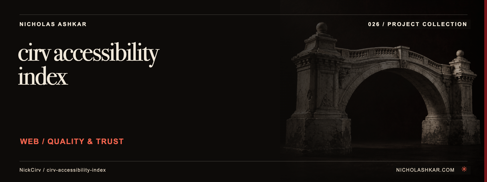

# cirv-accessibility-index

Crawls public storefront homepages, stores static accessibility findings and builds a Cirvgreen directory with a read API.


<a id="crawl-the-default-seed-list-into-dataindexdb"></a>

<a id="generate-the-static-directory-into-public"></a>

<a id="or-do-both-in-one-step"></a>

<a id="open-the-result"></a>

<a id="commands"></a>

<a id="crawler-flags"></a>

<a id="build-site-flags"></a>

<a id="what-it-scans"></a>

<a id="data-schema"></a>

<a id="rest-api"></a>

<a id="deploy"></a>

## What it does

- Seeded crawler.
- SQLite history.
- Static directory build.
- API keys and usage limits.
- Separate liveness/readiness endpoints.


<a id="install"></a>

<a id="quick-start"></a>

## Quickstart

Prerequisites: Node.js `22.x` and npm. The checkout below pins the source used for this documentation.

```sh
git clone https://github.com/NickCirv/cirv-accessibility-index.git
cd cirv-accessibility-index
git checkout 068719ce5709f958d8ca2b9c9f022d15696fb4a8
npm install
npm run report
```

**Expected behavior (illustrative, not captured):** Reads the local SQLite scan store and produces a report; populated scan data is needed for a useful report.

Examples are source-inspected, **not runtime-tested**. See the research record for verification gaps.


<a id="what-it-is-not"></a>

## Boundaries and data

Static homepage signals do not establish legal compliance or whole-site accessibility. Crawling contacts public sites; optional Firecrawl and Stripe integrations are external services. This review does not verify a live deployment.


<a id="part-of-the-cirv-suite"></a>

<a id="contributing"></a>

## Development

The manifest defines `npm test` as:

```sh
node test.js && node api/test.js
```

The captured tests cover selected implementation paths; their presence does not establish a passing run. Tests were not run for this documentation revision.

See [implementation and command reference](docs/REFERENCE.md) for the package scripts and inspected interfaces, and [research record](docs/RESEARCH.md) for the pinned source, document decisions and unresolved checks.

Updated [contribution guidance](CONTRIBUTING.md), [security policy](SECURITY.md) and [vendored-engine decision](docs/adr/0001-vendored-engine.md) remain authoritative. Cirvgreen product branding is preserved.

## License and contact

See [LICENSE](LICENSE) for the original terms and attribution. Legal text is unchanged.

[Nicholas Ashkar](https://nicholashkar.com/) · [Discuss a project](https://nicholashkar.com/#oxblood-contact)
